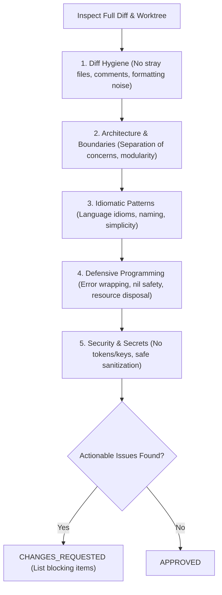

# Code Review Skill

This skill acts as a senior peer reviewer. It audits the complete branch diff, staged changes, and untracked files against architectural guidelines, language idioms, defensive error handling, and security standards before any commit or pull request.

---

## 1. Audit Scope

Always inspect the complete change context. Resolve the base branch first — never
assume `main`:

```bash
git symbolic-ref --short refs/remotes/origin/HEAD   # e.g. origin/main
git diff origin/<base>...HEAD                       # branch diff against the merge base
git diff HEAD                                       # staged + unstaged worktree changes
git status --porcelain                              # untracked files
```

`AGENTS.md` records the resolved base branch under **Base Branch**; fall back to it
when the symbolic ref is not set. Substitute the branch name yourself rather than
assembling a shell pipeline — these commands must run identically in bash, zsh,
PowerShell, and Command Prompt.

---

## 2. Evaluation Rubric



### Rubric Breakdown

1. **Diff Hygiene**:
   - Only intentionally modified files are present.
   - No accidental debug logging (`console.log`, `fmt.Println`), leftover commented-out code, or unintended whitespace modifications.
2. **Architecture & Boundaries**:
   - Code respects project layer separation (e.g. gameplay vs startup entrypoint, or server actions vs presentation components).
   - Package/module boundaries are clean with minimal tight coupling.
3. **Idiomatic Style & Simplicity**:
   - Conforms to idiomatic practices for the language (Go, TypeScript, Rust, Swift, Python).
   - Keeps methods and functions concise; avoids over-engineering or premature abstractions.
4. **Defensive Programming & Error Handling**:
   - Errors are checked, wrapped, or handled explicitly. Never silently ignored.
   - Resource cleanup is guaranteed (`defer`, `finally`, `using`, RAII).
   - Null/nil pointer dereferences and out-of-bounds indexing are guarded.
5. **Security & Secrets Hygiene**:
   - Zero credentials, API tokens, passwords, or private key data committed.
   - User inputs sanitized and validated at boundaries.
6. **Instructions That the Change Invalidated**:
   - A diff that renames or moves a path `AGENTS.md` documents, changes a command it
     lists, or alters a constraint it states — without `AGENTS.md` in the same diff —
     is a finding. Name the line that is now wrong.
   - This is the moment drift is created, and the only moment it is cheap to fix.
     Nobody rereads an instruction file looking for lies; the next agent simply
     believes it.
   - Judge what the change made untrue, not whether the file is comprehensive.
     "AGENTS.md could say more" is not a review finding.

---

## 3. Execution Context

The managed workflow decides whether the main agent delegates this skill to the
`code-reviewer` subagent or runs it inline. Perform the review in the current
context; never delegate again from inside this skill, which would recurse when a
`code-reviewer` is already following it.

---

## 4. Code Review Report Output Template

```markdown
### Code Review Summary
- **Reviewer Persona**: Senior Staff Reviewer (`<Language / Framework>`)
- **Diff Evaluated**: `<branch name> (<N> files changed, +<X> / -<Y> lines)`

#### Rubric Evaluation
- [x] **Diff Hygiene**: Pass (Clean diff, no extraneous files or debug logs)
- [x] **Architectural Integrity**: Pass (Respects package boundaries and layering)
- [x] **Language Idioms & Simplicity**: Pass (Idiomatic, maintainable structure)
- [x] **Error Handling & Resilience**: Pass (Explicit error checks and resource cleanup)
- [x] **Security & Secrets**: Pass (No secrets or unsanitized inputs)

- **Verdict**: [APPROVED | CHANGES_REQUESTED]
- **Actionable Feedback**:
  - *(List specific file:line findings if changes are requested)*
```
