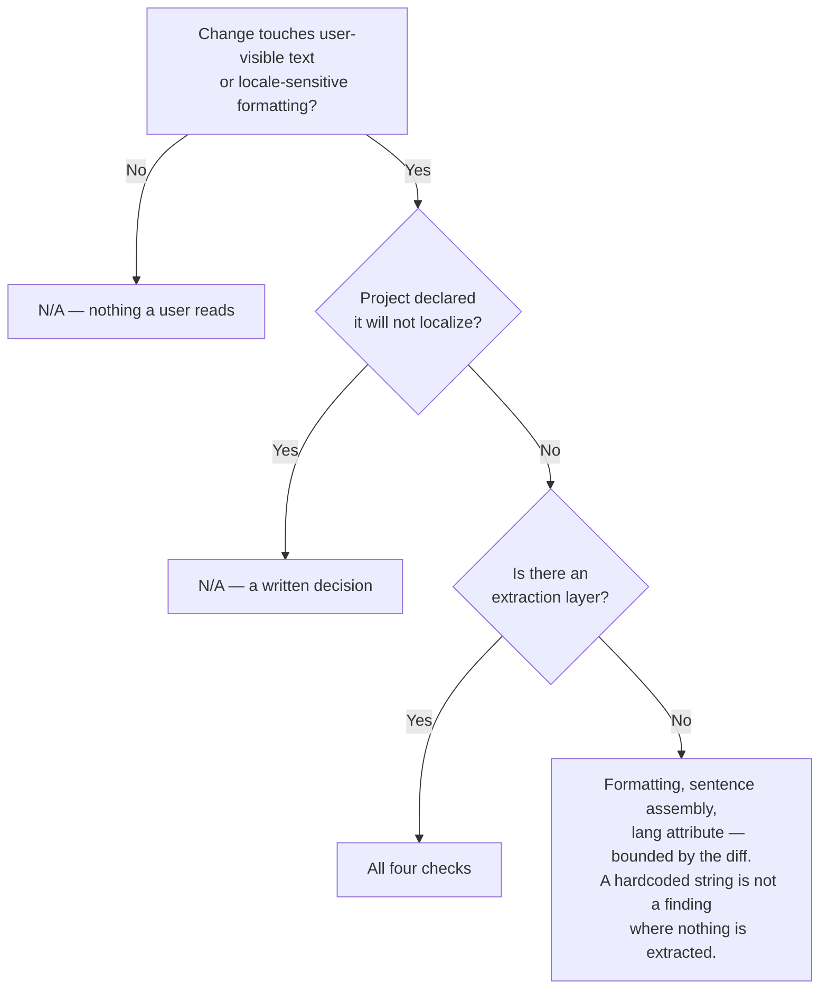

# Localization Review Skill

This skill audits one question: **is this change localizable — could the
application ship in another language without rewriting it?**

Not "does it ship in another language today". The point is to keep the door
open, so that adding a language later is a translation job rather than a
retrofit. That makes the most valuable moment to run this the one *before* a
second locale exists.

That is not the question UI review answers. A UI review looks at a rendered
frame and asks whether it looks right — and a frame rendered in the language the
strings were written in looks right precisely when localization is broken. Nor is
it a question a code reviewer reading a diff reliably thinks to ask: a hardcoded
string is valid code, a `n === 1` plural rule is correct English, and
`"Showing " + count + " of " + total` reads perfectly well until word order
changes.

Run after UI review, as ordered by the managed workflow.

---

## Execution Context

When localization review is a stage of the managed workflow, it runs in the
`localization-reviewer` subagent, invoked by the main agent — never in the main
agent's own context. The review is requested there, not performed there.

Being asked directly for a localization review is not a managed stage: perform
it, and say which context it ran in. Inside the subagent, follow the protocol
below and never delegate again — that would recurse.

---

## 1. Does This Stage Apply?

**One condition:** the change adds or alters **user-visible text**, or the
formatting of a date, number, currency, name, address, or list.

That is deliberately not "does the project ship more than one locale". The
purpose of this stage is to keep the application **localizable** — so that
adding a language later is a translation job rather than a rewrite. The moment
that is worth the most is *before* a second locale exists, because that is when
the habits get set and when nothing else is watching.

`N/A` in exactly two cases:

- The change is confined to documentation, comments, configuration, build
  scripts, CI, or tests — nothing a user reads.
- The project has **declared it will not localize**. That is a decision
  **written down** in `## Project overview` (`Locales: single locale, not intended`),
  not something you infer from a missing catalog. An internal CLI, a build tool,
  a service with no human-facing text: these are legitimate and permanent `N/A`,
  and reporting on them is noise.

A missing catalog is **not** an `N/A`. It is the case this stage exists for.

---

## 1a. What the project already has decides what you report

This is the difference between a useful review and one people stop invoking, so
it has to be decided by evidence rather than impression. **It is a search for
named artifacts, not a judgement.** Look for a catalog format and a runtime,
across the ecosystems the project actually uses:

| Where to look | What counts |
|---|---|
| Dependency manifest | `i18next`, `react-i18next`, `next-intl`, `react-intl`, `@formatjs/*`, `@lingui/*`, `vue-i18n`, `gettext`, `Fluent`, `go-i18n`, `rails-i18n` |
| Catalog files | `.po`/`.pot`, `.xliff`/`.xlf`, `.arb`, `.resx`, `.properties`, `messages.*.json`, `*.ftl` |
| Apple | `*.lproj/`, `Localizable.strings`, `*.xcstrings`, `NSLocalizedString(` |
| Android | `res/values-*/strings.xml`, `getString(R.string.` |
| Rails / Java / Spring | `config/locales/*.yml`, `messages_*.properties`, `I18n.t(`/`t(` |
| Routing & config | a `[locale]`/`:lang` route segment, an `i18n` block in the framework config, a locale middleware |

**Say what you looked for and what you found**, so the caller can correct you —
a list of absent things is a checkable claim, "no i18n found" is not.

Three outcomes, and only the middle one is a judgement call:

- **Artifacts present, used throughout** — the layer exists.
- **Artifacts present, but parts of the codebase bypass them** — the layer exists,
  and this is the most valuable case: a new string in a file whose neighbours use
  the catalog is a plain defect, because the mechanism is right there. Say which
  files are on which side.
- **Nothing found** — no layer. This is a fact about the tree, not about intent.
  Whether the project *will* localize is not inferable from it, which is why the
  only thing that makes this stage `N/A` is a decision someone wrote down.

### The project has an extraction layer

Apply all four checks in § 2. A string that bypasses the catalog the project
already maintains is a straightforward defect: the mechanism exists and this
change did not use it.

### The project has none

Then "extract every string" is not a review finding, it is a project decision
worth many days, and reporting it per-string buries everything else. Report the
absence **once**, plainly, and then confine your findings to what is *cheap now
and expensive later*:

- **Locale-sensitive formatting done by hand** — dates, numbers, currency,
  plurals, lists, sorting, case transforms. `Intl.DateTimeFormat` is no harder
  to write than `${d.getMonth() + 1}/${d.getDate()}`, is correct in the one
  language the project ships today, and is the difference between a translation
  job and an audit later. This is the highest-value finding in a single-locale
  codebase.
- **Sentences assembled from fragments.** Concatenation cannot be translated at
  all — word order, gender and case endings depend on the whole sentence. This
  is the most expensive kind to retrofit, because it is a redesign rather than
  an extraction.
- **The document language attribute**, if absent or wrong. One line, and screen
  readers and hyphenation depend on it today, not later.

The line that matters is **the diff, not the codebase**. Report what this change
introduces; never audit what was already there.

And in this state a hardcoded string is **not** a finding. Where nothing is
extracted, every string is hardcoded, so naming the two or three a diff happens
to touch is arbitrary: it reports the codebase's standing condition as though it
were this change's defect, and the caller cannot act on it without a project
decision they were not asked to make. Adopting a catalog is that decision, and
it belongs to them, not to a review. Note the absent layer once and move on.

What *does* survive in this state is everything above: formatting a date or a
number or a plural by hand is wrong in one language too, and a concatenated
sentence has to be redesigned rather than translated. Those are cheap now,
expensive later, and independent of whether a catalog exists.

So: no inventory of every literal in the repository, no demand for a framework,
no estimate of translation effort. And do not report layout expansion or RTL as defects — without
translations there is nothing to measure, so at most note once that physical CSS
properties (`margin-left`) would need to become logical ones
(`margin-inline-start`) when the day comes.

**Never invent findings to justify the stage.** A gate that manufactures work is
one people learn to stop invoking — and the single-locale case is where that
temptation is strongest.

---

## 2. The Four Checks



### 1. Extraction — is the text reachable by a translator?

- User-visible strings come from a catalog, not from literals in the component.
- **Sentences are not assembled from fragments.** `t("showing") + count + t("of")`
  cannot be translated: word order, grammatical gender, and case endings all
  depend on the whole sentence. Interpolation into one complete string is the fix
  (`t("showing_x_of_y", {count, total})`).
- Keys are stable and meaningful. A key that *is* the English text makes every
  copy edit a retranslation.
- No text baked into an image, an SVG, or a sprite sheet.

### 2. Formatting — is anything hand-rolled that a locale API owns?

- **Dates and times** through the platform's locale formatter, never
  `` `${d.getMonth()+1}/${d.getDate()}` `` — that is American order, stated as if
  universal. Watch time zones as a separate axis from language.
- **Numbers and currency** through a locale formatter. Decimal separators,
  grouping, and symbol placement all move; currency is not a number with a `$`
  in front.
- **Plurals** through a plural-rules API. `n === 1 ? "item" : "items"` is a
  two-form assumption; Polish has four categories, Arabic six. A "zero" case is
  a distinct category in some languages, not just an `if`.
- **Lists** through a list formatter — `join(", ")` with `" and "` before the
  last is English-specific.
- **Sorting** through a collator. Byte order is not alphabetical order in any
  language with accents, and it is badly wrong in several.
- **Case transforms**: `toUpperCase()` is locale-sensitive (Turkish dotless ı is
  the standard example). Prefer CSS for presentational casing.

### 3. Rendered consequence — does the layout survive?

- **Text expands.** German and Finnish commonly run 30% longer than English;
  short UI labels can double. Check fixed widths, single-line buttons, table
  headers, tab bars, and anything with `text-overflow: ellipsis` hiding the
  problem rather than showing it.
- **Right-to-left.** Does the layout mirror — including icons that indicate
  direction, progress, and back/forward? Are logical properties (`margin-inline-start`)
  used rather than physical ones (`margin-left`)?
- **Scripts differ in height.** CJK, Thai, and Devanagari need more line height
  than Latin; fixed `height` on a text container clips them.
- **The font must have the glyphs.** A stack that falls back silently renders
  tofu boxes, which look like a rendering bug rather than a missing font.

### 4. The surfaces nobody screenshots

The ones that survive review precisely because no reviewer looks at them:

- The document language attribute (`<html lang>`), which drives hyphenation,
  quotation marks, and screen-reader voice selection.
- Page titles, meta descriptions, and anything that reaches a browser tab or a
  share card.
- `alt` text, `aria-label`, and other accessible names — untranslated, they leave
  screen-reader users in a different language from everyone else.
- **Server-side messages.** Validation and error text generated in the backend
  frequently misses the i18n layer the frontend uses.
- Notification, email, and SMS templates.
- PDF or export output, and log messages a user will actually be shown.

---

## 3. Evidence

**A pseudo-locale is evidence; an opinion is not.**

Where the project can render one — an accented or lengthened pseudo-locale, or a
real translation, or an RTL locale — render it and report what you observed.
Where you cannot run it, say plainly that the finding comes from reading the code
rather than from running it. That distinction is the same one the UI reviewer
owes, and for the same reason: only running it tells you what it does.

Report what you could not evaluate and why — a locale that does not exist yet, a
build you could not run, a surface you could not reach.

---

## 4. Localization Review Report Template

```markdown
### Localization Review Report
- **Locales**: `<what the project ships, and how you determined it>`
- **Extraction layer**: `<the catalog and framework, and where — or "none found",
  with what you looked for>`
- **Surface Inspected**: `<component, route, template, or message set>`
- **Evidence / Run Method**: `<pseudo-locale rendered, RTL run, or "read only">`

#### Evaluation Matrix
| Check | Status | Observations |
|---|---|---|
| Extraction | [PASS / FAIL / NA] | Strings catalogued; no concatenated sentences |
| Formatting | [PASS / FAIL / NA] | Dates, numbers, plurals, lists via locale APIs |
| Rendered consequence | [PASS / FAIL / NA] | Survives +30% text and RTL |
| Non-rendered surfaces | [PASS / FAIL / NA] | lang, titles, alt text, server messages |

With no extraction layer, `Extraction` is `NA` for per-string reporting — say so
once in Observations — while `Formatting` and `Non-rendered surfaces` still
apply, and `Rendered consequence` is `NA` because there is nothing to measure.

- **Verdict**: [APPROVED | CHANGES_REQUESTED | N/A]
- **Actionable Findings**: (with `file:line`, most severe first — or None)
- **Not evaluated**: (None, or what you could not reach and why)
```

The verdict is `N/A` only when § 1 says the stage does not apply. A review that
ran and found nothing is `APPROVED`, and says what it looked at.

**When no extraction layer exists, say so in the verdict line itself** —
`APPROVED (no extraction layer)`. A bare `APPROVED` on a project where nothing
is extracted reads as "localization is in good shape", which is the opposite of
true: it means this change introduced no *new* locale-correctness defect, on top
of a codebase that cannot be translated at all. That standing condition is the
caller's to act on — adopting a catalog is a project decision, not a review
finding — but it must not be something they have to infer from an absence.

Say it **once**, and point at where the signal belongs: the project's `Locales:`
line in `## Project overview`. The qualifier is invariant — every review of the
same repository emits it — so re-arguing it each time habituates the reader
exactly as a repeated finding would. One line, then a pointer to the decision
that would settle it.
