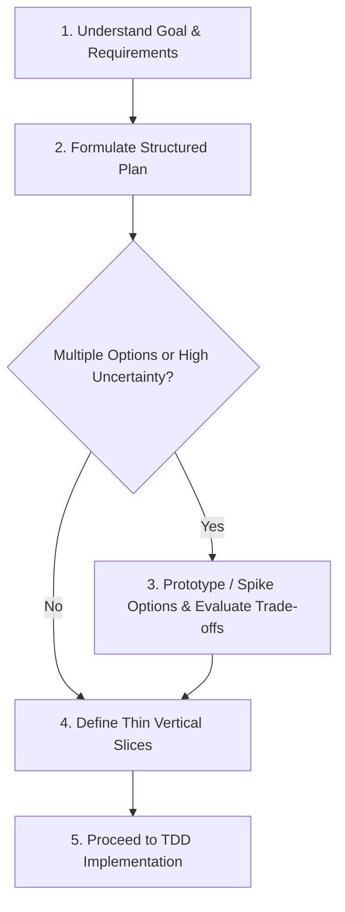

# Plan and Prototype Skill

This skill governs the initial phase of any feature, refactor, or complex fix: formulating a structured plan first, defining thin vertical slices, and prototyping/spiking alternative approaches when multiple architectural or UX options exist.

---

## 1. Upfront Planning Protocol

Never jump straight into modifying production code for non-trivial tasks. Always plan first:



### Upfront Planning Checklist

1. **Clarify Desired Outcome**: Identify the operational or user-visible goal.
2. **Identify Boundaries & Invariants**: Determine which systems, state models, or packages are touched.
3. **Decompose into Thin Slices**: Break down large features into ordered, independent vertical slices that each deliver a testable, reviewable outcome.
4. **Define Verification Strategy**: Outline how each slice will be tested (unit tests, mock boundaries, or interactive visual verification).

---

## 2. When and How to Prototype Options

### When to Prototype

- **Architectural Trade-offs**: When multiple viable patterns exist (e.g. struct vs protocol composition, polling vs event-driven, synchronous vs async dispatch).
- **API & Library Feasibility**: When integrating new third-party APIs, platform frameworks, or unfamiliar libraries.
- **UX & Interaction Exploration**: When exploring layout, gesture, or state transition ergonomics.

### Prototyping Guidelines (The Spike Protocol)

1. **Timebox & Isolate**: Keep spikes minimal and isolated (e.g. in scratch files, lightweight spike tests, or throwaway branch experiments).
2. **Test Specific Hypotheses**: Focus the prototype strictly on resolving the unknown (performance, ergonomics, API compatibility).
3. **Evaluate with a Trade-off Matrix**:

   | Option | Pros | Cons | Complexity | Recommendation |
   |---|---|---|---|---|
   | Option A: `<Approach>` | Fast, simple | Limited extensibility | Low | Recommended |
   | Option B: `<Approach>` | Highly flexible | Higher boilerplate | Medium | Alternative |

4. **Align & Clean Up**: Select the winning path (aligning with the user if valuable). Do not directly commit messy spike code; distill the proven pattern cleanly into the test-first `tdd-workflow` loop.

---

## 3. Plan & Prototype Output Template

```markdown
### Implementation Plan
- **Goal**: `<summary of feature or fix>`
- **Proposed Slices**:
  1. Slice 1: `<minimal end-to-end slice>`
  2. Slice 2: `<subsequent slice>`

#### Prototype / Design Options (if evaluated)
- **Option 1 (Chosen)**: `<description and rationale>`
- **Option 2 (Discarded)**: `<description and reason>`

- **Verification Strategy**: `<focused test suite + UI audit>`
```
