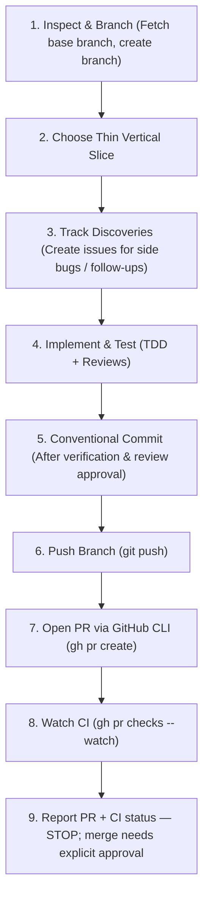

# Slice and PR Lifecycle Skill

This skill governs the operational lifecycle of changes: decomposing large issues into thin vertical slices, enforcing dedicated branch creation, writing structured Conventional Commits, tracking bugs/follow-up issues, and managing pull requests via GitHub CLI (`gh`).

---

## 1. Lifecycle Workflow



---

## 2. Rules & Protocols

### A. Branch Creation
- Resolve the repository's base branch first — never assume `main`:
  `git symbolic-ref --short refs/remotes/origin/HEAD` (falls back to whatever
  `AGENTS.md` records under **Base Branch**).
- Always fetch the latest upstream state before branching: `git fetch origin <base>`.
- Create a dedicated branch: `git checkout -b <owner>/<type>/<short-description> origin/<base>`.
  `<owner>` is your GitHub login (`gh api user --jq .login`).
- Allowed branch types: `feat`, `fix`, `refactor`, `chore`, `test`, `docs`.
- Never commit directly to the base branch.

### B. Thin Vertical Slices
- Define the smallest end-to-end slice that delivers a coherent outcome and can be independently reviewed, tested, and shipped.
- Avoid large horizontal layers (e.g. implementing 10 database models before any UI or business logic).
- Keep pull requests small enough for reliable review, verification, and fast rollback.

### C. Capturing Discoveries, Bugs & Follow-ups
- When unexpected bugs, edge cases, technical debt, or follow-up tasks are identified during the course of development:
  - **Do NOT expand the scope of the current slice** (prevent scope creep).
  - **Create a tracked issue immediately** using the project's source control management / issue system:
    - **GitHub**: `gh issue create --title "<type>(<scope>): <summary>" --body "<details & reproduction>"`
    - **GitLab / Jira / Azure DevOps**: Use the respective CLI (`glab`, `jira`, `az`) or tracker.
    - **Local / No Tracker**: Record in a project markdown file (`ISSUES.md`, `ROADMAP.md`, or `## Notes & Learned Patterns` in `AGENTS.md`).
  - Keep the current branch focused on completing its single reviewed slice.

### D. Conventional Commits
Commit only after UI review, verification, and code review have all passed:

```text
<type>(<scope>): <imperative summary>

[optional body explaining why this change was made]
```

- Subject line <= 72 characters.
- Stage files explicitly; never run blind `git add -A` if unrelated work exists in the worktree.

### E. GitHub CLI (`gh`) Automation
Use Git for branch transport and the GitHub CLI (`gh`) for GitHub operations:

- **Match the stopping point to the request.** A request that only asks to commit
  stops after the local commit. A request that asks to use, follow, or complete
  the workflow—including "commit based on the workflow"—includes the reversible
  remote steps: push the branch, open the PR, and watch its checks. It does not
  authorize a merge or any action in § F.

```bash
# 1. Push Branch
git push -u origin <branch>

# 2. Create Pull Request
gh pr create --title "<type>(<scope>): <summary>" --body "<why this change was made and what was verified>"

# 3. Monitor CI status
gh pr checks --watch
```

- Never bypass failing or pending CI checks.
- Open ready-for-review PRs by default unless explicitly asked for a draft.

### F. Actions That Require Explicit Approval

The agent stops after reporting PR status. These commands are **never** run on the
agent's own initiative — only when the user asks for them in the current conversation:

```bash
gh pr merge --squash --delete-branch   # merging
git push --force / --force-with-lease  # rewriting published history
gh pr close / gh issue close           # closing others' work
```

Approval given for one PR does not carry to the next. When work is ready, report the
PR URL and CI status, then wait.

### G. Finish the Merge

**Squash by default.** `gh pr merge --squash --delete-branch`. One reviewed slice
becomes one commit on the base branch: the false starts, the fixups and the "address
review" commits describe how the work got made, not what it is. Keeping them turns the
base branch into a diary and makes reverting the slice an archaeology exercise instead
of a single revert.

The trade is that the intermediate commits go, so the PR description is what survives —
which is why it carries the reasoning and the evidence (§ E). If a project requires
merge commits or a rebase instead, its own `AGENTS.md` says so and that wins.

An approved merge takes its own branch with it — `--delete-branch` covers the remote,
and the local copy goes too. That deletion is part of the merge, not a second act
needing its own approval; no *other* branch is included in it.

A merged branch left lying around is a decoy. It reads as work in flight, and nobody
can tell it from the real thing without diffing it against the base.

Two things to know before deleting:

- **Check first.** `git diff <base> <branch>` — empty output means every line is in
  the base and nothing is lost. If it is not empty, stop and find out why.
- **Squash merges look unmerged.** A squash writes a new commit instead of joining
  histories, so git sees no ancestry and `git branch -d` refuses a branch that is
  fully merged. After the diff above comes back empty, `-D` is the correct tool
  there, not a force.

```bash
git diff main scottdensmore/feat/thing   # expect no output
git branch -D scottdensmore/feat/thing   # -d refuses after a squash merge
git push origin --delete scottdensmore/feat/thing
```
