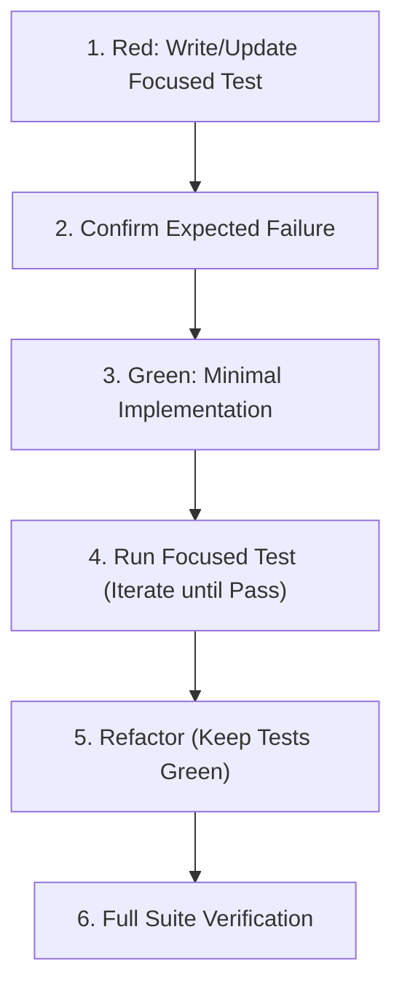

# Test-Driven Development (TDD) Workflow

This skill guides the agent through disciplined, test-first software development. It ensures high test coverage, prevents regressions, and produces clean, modular architecture.

---

## 1. When to Use TDD

- **Always use TDD for testable units**: Pure logic, business rules, calculations, parsers, state machines, data transformations, API route handlers, and service boundaries.
- **When unit testing is not feasible**: Frame-by-frame canvas rendering, hardware audio buffer outputs, low-level OS device handles, or closed external systems. For these, state clearly that unit testing is not feasible, and substitute visual or interactive verification (see `ui-review` skill).

---

## 2. The TDD Execution Loop (Red-Green-Refactor)

Follow these phases strictly:



### Step 1: Red — Write the Minimal Failing Test
- Identify the single slice of behavior or the specific bug reproduction needed.
- Write or update a focused test before touching production code.
- Name the test clearly following project conventions (e.g. `TestScoreManager_AddPoints` or `it('should calculate discount when promo code applied')`).

### Step 2: Confirm Failure Reason
- Execute the focused test runner (e.g. `go test -run TestName ./...` or `npm test -- -t "test name"`).
- **Verify that the test fails for the expected reason** (e.g. missing function, assertion mismatch, returned error) rather than a syntax or compile error in the test harness itself.

### Step 3: Green — Minimal Implementation
- Write the simplest, cleanest implementation necessary to make the failing test pass.
- Resist premature optimization or adding speculative features not required by the test.

### Step 4: Validate Passing Test
- Re-run the focused test command.
- Iterate rapidly on the implementation until all assertions pass.

### Step 5: Refactor
- Clean up duplication, improve variable names, extract small helpers, and enforce code conventions.
- Run tests continuously during refactoring to guarantee no regression.

---

## 3. Test Isolation & Mocking Guidelines

1. **Test Boundaries**:
   - Focus unit tests on the unit under test.
   - Use test doubles/mocks only at true external boundaries (network APIs, databases, third-party services).
   - Prefer realistic in-memory fakes or standard library test helpers over complex mocking frameworks when possible.
2. **Preserve Existing Coverage**:
   - Never delete or disable existing passing tests unless requirements have explicitly changed.
   - Fix regressions immediately before adding new features.
3. **Flake Zero-Tolerance**:
   - Treat flaky or timing-dependent tests as defects. Fix race conditions and nondeterministic seeds immediately.

---

## 4. TDD Summary Output Template

When reporting completed TDD work, include a concise note:
```markdown
### TDD Cycle Completed
- **Target Component**: `<path/to/component>`
- **Test File**: `<path/to/test_file>`
- **Focused Test Command**: `<command>`
- **Outcome**: Red confirmed -> Green passing -> Refactored clean.
```
