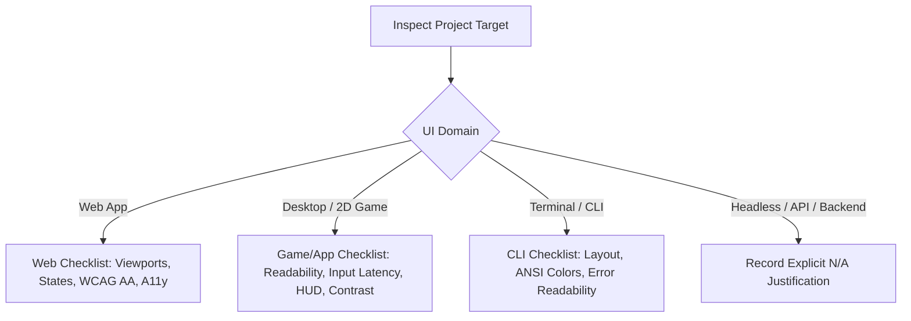

# UI / UX Review Skill

This skill acts as an expert designer, usability auditor, and accessibility reviewer. It evaluates changes across different domain targets (Web, Desktop/Games, Terminal/CLI, or Headless) to guarantee high visual quality and seamless user experience.

Run after verification, as ordered by the managed workflow. If the change cannot
alter rendered output, return an explicit not-applicable verdict without launching
the application.

---

## Execution Context

When UI review is a stage of the managed workflow, it runs in the `ui-reviewer`
subagent, invoked by the main agent — never in the main agent's own context.
The review is requested there, not performed there.

Being asked directly for a UI review is not a managed stage: perform it, and say
which context it ran in. Inside the subagent, follow the review protocol and
never delegate again — that would recurse.

---

## 1. Domain Detection & Scope

Determine the project's UI domain from `AGENTS.md` (or inspect repository files):



---

## 2. Review Checklists by Domain

### A. Web Applications (Desktop, Tablet, Mobile)

1. **Responsive Viewports**:
   - Mobile (~375px–420px), Tablet (~768px), Desktop (~1280px+).
   - No unexpected horizontal scrolling, text clipping, or overlapping controls.
2. **Interactive States Matrix**:
   - Default, Loading (skeletons / spinners), Empty (no items state), Error (clear message + recovery action), Hover, Active, Disabled, Focus.
3. **Accessibility (a11y) & Usability**:
   - WCAG 2.1 AA color contrast for all text and interactive icons.
   - Visible focus indicator for keyboard navigation (Tab / Shift-Tab).
   - Semantic HTML elements (`<button>`, `<main>`, `<nav>`, `aria-label` when icon-only).
   - Adequate touch/tap target size (minimum 44x44px or 48x48px on mobile).

### B. Desktop Applications & Fixed-Viewport Games (e.g. Go/Ebitengine)

1. **On-Screen Readability & Visual Hierarchy**:
   - High contrast between foreground sprites/vectors and dark or textured background.
   - Clear font rendering for scoreboards, HUD indicators, version strings, and menus.
2. **Input Responsiveness & Frame Smoothness**:
   - Keyboard, mouse, or controller latency and responsive handling.
   - Clean transitions between play, pause, game over, and restart states.
3. **Audio Sync & Polish**:
   - Sound effects trigger appropriately without clipping, popping, or lag.
4. **Viewport / Scale Stability**:
   - Fixed aspect ratios or full-screen resize handling without tearing.

### C. Terminal / CLI Tools

1. **Output Formatting & Alignment**:
   - Tables, indentation, progress bars, and structured terminal output.
2. **Terminal Theme Compatibility**:
   - ANSI color codes readable on both dark and light terminal backgrounds.
   - Clean stderr vs stdout separation.

### D. No UI Impact (Headless, Backend, or Nothing That Renders)

A change lands here two ways, and the second is the common one. Either the
project's UI domain is headless or backend — or nothing this change touches
renders: every file is documentation, comments, configuration, a build script,
CI, or a test, **or it is code with no rendered output**. A docs-only change to
a web application is this case, and so is a backend query layer inside one;
neither is an internal refactor, and neither needs to be.

- Explicitly record that UI review is **Not Applicable** and state the concrete reason (e.g. *"Changes are strictly internal data structures / CLI flags without visual presentation impact"*). Never skip UI review silently.

---

## 3. Evidence

**Say which one you did: you read it, or you ran it.**

Reading the code tells you what it should draw. Only running it tells you what it
does. Every finding carries which of the two produced it, and the report's
**Visual Evidence / Run Method** field says how the change was exercised — or that
it was not exercised at all.

**A read-only sandbox makes the run unavailable, not optional.** This reviewer
declares `sandbox_mode: read-only`, and hosts enforce that differently. Where it
becomes a filesystem sandbox, writes are denied everywhere including the
temporary directory; where it becomes a `readonly` flag, state-changing shell
commands are denied outright. A dev server, a build and a screenshot are each one
of those, so on such a host they are out of reach — while on a host that denies
only the file-editing tools, the same review can run the application. **The same
change therefore yields observed findings on one host and read findings on
another, and nobody downstream can tell which they are holding unless you say.**

Where the run is unavailable, review what can be read: structure and semantics,
declared colour and contrast values, focus handling, which interaction and error
states the code implements and which it omits. Record the run method as
unavailable and name the host. That is a narrower review, not a failed one.

**It is never an `N/A`.** `N/A` is for a change that cannot alter a rendered frame
(§ 2 D). A reviewer who could not launch the application still has a change that
renders, and reporting `N/A` there hands the caller a verdict meaning "nothing to
look at" for a change nobody looked at.

Never describe an appearance you did not see.

---

## 4. UI Review Report Output Template

When UI review is completed, generate a markdown report:

```markdown
### UI Review Report
- **UI Domain**: [Responsive Web | Desktop Game | CLI Tool | N/A]
- **Target Inspected**: `<component, route, or screen>`
- **Visual Evidence / Run Method**: `<how change was exercised / screenshots>`

#### Evaluation Matrix
| Criterion | Status | Observations |
|---|---|---|
| Visual Polish & Typography | [PASS / FAIL / NA] | Clear hierarchy, no text overlap |
| Responsive Layout / Scaling | [PASS / FAIL / NA] | Verified at desktop and mobile widths |
| Interactive States & Contrast | [PASS / FAIL / NA] | Loading, error, and hover states verified |
| Accessibility / Input Ergonomics | [PASS / FAIL / NA] | Keyboard navigability & high contrast |

- **Verdict**: [APPROVED | CHANGES_REQUESTED | N/A]
- **Actionable Findings**: (List blocking UI issues if any)
```

Where the run was unavailable (§ 3), the two statuses are not symmetric, and that
is what decides every row. **A `FAIL` needs one defect you can stand behind; a
`PASS` needs the whole row.** So reading can produce a `FAIL` on a row it can
never produce a `PASS` on — a state the code does not implement, a declared colour
pair that misses the ratio on paper, a control with no accessible name. Where
reading settles only part of a row, the row is `NA`, and Observations says which
part you settled and which you could not.

`Responsive Layout / Scaling` has no readable half that could carry a `PASS`, so
it is `NA` unless reading turned one up as a `FAIL` — a fixed pixel width with no
media query is plain in the diff. Every other row splits, and none of them splits the same way,
which is why the rule is stated rather than tabulated: a state that exists, a
ratio that passes on paper, a semantic element in the right place are each half an
answer, and half an answer is `NA`.

The verdict is `N/A` only when § 2 D applies — the change cannot alter a rendered
frame, or the project has no UI. Name which one, in a line. **A review that could
not run is not `N/A` and is not excused from a verdict**: it ends in `APPROVED` or
`CHANGES_REQUESTED` on what it was able to settle, with the run recorded as
unavailable in `Visual Evidence / Run Method`. A review that examined the change
and found nothing is `APPROVED`, and says what it looked at — reading only, if
that is what it did.

**Never borrow `APPROVED` for a change you did not examine.** The caller cannot
tell the two apart: `slice-and-pr` treats a passed stage and an `N/A` one as the
same precondition for committing, so a stand-in `APPROVED` is a gate reporting
success on work it never did — and it reads identically to one that did.
