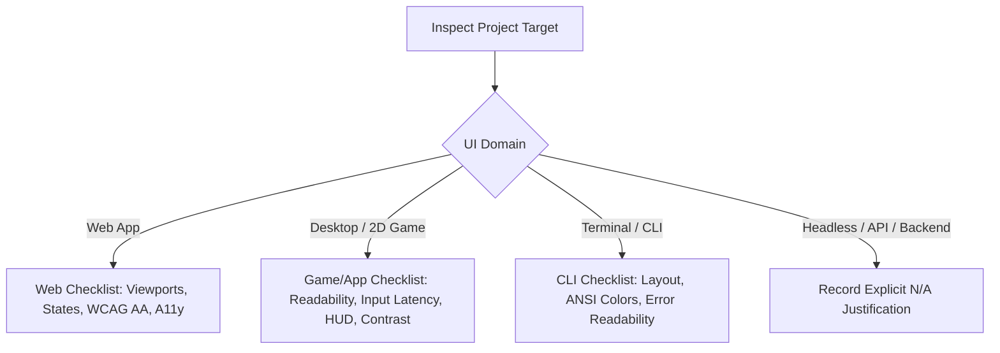

# UI / UX Review Skill

This skill acts as an expert designer, usability auditor, and accessibility reviewer. It evaluates changes across different domain targets (Web, Desktop/Games, Terminal/CLI, or Headless) to guarantee high visual quality and seamless user experience.

Run after verification, as ordered by the managed workflow. If the change cannot
alter rendered output, return an explicit not-applicable verdict without launching
the application.

---

## Execution Context

When UI review is a stage of the managed workflow, it runs in the `ui-reviewer`
subagent, invoked by the main agent — never in the main agent's own context.
The review is requested there, not performed there.

Being asked directly for a UI review is not a managed stage: perform it, and say
which context it ran in. Inside the subagent, follow the review protocol and
never delegate again — that would recurse.

---

## 1. Domain Detection & Scope

Determine the project's UI domain from `AGENTS.md` (or inspect repository files):



---

## 2. Review Checklists by Domain

### A. Web Applications (Desktop, Tablet, Mobile)

1. **Responsive Viewports**:
   - Mobile (~375px–420px), Tablet (~768px), Desktop (~1280px+).
   - No unexpected horizontal scrolling, text clipping, or overlapping controls.
2. **Interactive States Matrix**:
   - Default, Loading (skeletons / spinners), Empty (no items state), Error (clear message + recovery action), Hover, Active, Disabled, Focus.
3. **Accessibility (a11y) & Usability**:
   - WCAG 2.1 AA color contrast for all text and interactive icons.
   - Visible focus indicator for keyboard navigation (Tab / Shift-Tab).
   - Semantic HTML elements (`<button>`, `<main>`, `<nav>`, `aria-label` when icon-only).
   - Adequate touch/tap target size (minimum 44x44px or 48x48px on mobile).

### B. Desktop Applications & Fixed-Viewport Games (e.g. Go/Ebitengine)

1. **On-Screen Readability & Visual Hierarchy**:
   - High contrast between foreground sprites/vectors and dark or textured background.
   - Clear font rendering for scoreboards, HUD indicators, version strings, and menus.
2. **Input Responsiveness & Frame Smoothness**:
   - Keyboard, mouse, or controller latency and responsive handling.
   - Clean transitions between play, pause, game over, and restart states.
3. **Audio Sync & Polish**:
   - Sound effects trigger appropriately without clipping, popping, or lag.
4. **Viewport / Scale Stability**:
   - Fixed aspect ratios or full-screen resize handling without tearing.

### C. Terminal / CLI Tools

1. **Output Formatting & Alignment**:
   - Tables, indentation, progress bars, and structured terminal output.
2. **Terminal Theme Compatibility**:
   - ANSI color codes readable on both dark and light terminal backgrounds.
   - Clean stderr vs stdout separation.

### D. No UI Impact (Headless, Backend, or Nothing That Renders)

A change lands here two ways, and the second is the common one. Either the
project's UI domain is headless or backend — or nothing this change touches
renders: every file is documentation, comments, configuration, a build script,
CI, or a test, **or it is code with no rendered output**. A docs-only change to
a web application is this case, and so is a backend query layer inside one;
neither is an internal refactor, and neither needs to be.

- Explicitly record that UI review is **Not Applicable** and state the concrete reason (e.g. *"Changes are strictly internal data structures / CLI flags without visual presentation impact"*). Never skip UI review silently.

---

## 3. UI Review Report Output Template

When UI review is completed, generate a markdown report:

```markdown
### UI Review Report
- **UI Domain**: [Responsive Web | Desktop Game | CLI Tool | N/A]
- **Target Inspected**: `<component, route, or screen>`
- **Visual Evidence / Run Method**: `<how change was exercised / screenshots>`

#### Evaluation Matrix
| Criterion | Status | Observations |
|---|---|---|
| Visual Polish & Typography | [PASS / FAIL / NA] | Clear hierarchy, no text overlap |
| Responsive Layout / Scaling | [PASS / FAIL / NA] | Verified at desktop and mobile widths |
| Interactive States & Contrast | [PASS / FAIL / NA] | Loading, error, and hover states verified |
| Accessibility / Input Ergonomics | [PASS / FAIL / NA] | Keyboard navigability & high contrast |

- **Verdict**: [APPROVED | CHANGES_REQUESTED | N/A]
- **Actionable Findings**: (List blocking UI issues if any)
```

The verdict is `N/A` only when § 2 D applies — the change cannot alter a rendered
frame, or the project has no UI. Name which one, in a line. A review that ran and
found nothing is `APPROVED`, and says what it looked at.

**Never borrow `APPROVED` for a change you did not examine.** The caller cannot
tell the two apart: `slice-and-pr` treats a passed stage and an `N/A` one as the
same precondition for committing, so a stand-in `APPROVED` is a gate reporting
success on work it never did — and it reads identically to one that did.
