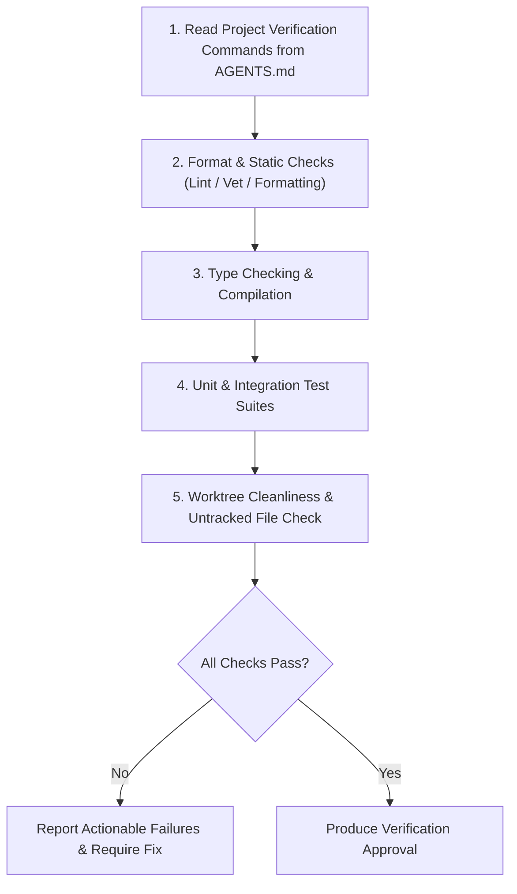

# Verifier Skill

This skill acts as the automated verification gatekeeper. It executes all required project builds, static analyses, format checks, and test suites, ensuring changes are regression-free before code review.

---

## 1. Verification Protocol



---

## 2. Dynamic Command Discovery

The verifier inspects `AGENTS.md` (or project metadata) for canonical commands. Common toolchains:

| Ecosystem | Linter / Formatter | Type Checker / Analyzer | Test Suite | Build |
|---|---|---|---|---|
| **Go** | `gofmt -l .` | `go vet ./...` | `go test -v ./...` | `go build ./...` |
| **TypeScript / Node** | `npm run lint` / `biome check` | `npx tsc --noEmit` | `npm test` | `npm run build` |
| **Python** | `ruff check .` / `black --check .` | `mypy .` | `pytest` | `python -m build` |
| **Rust** | `cargo fmt --check` | `cargo clippy -- -D warnings` | `cargo test` | `cargo build --release` |
| **Swift** | `swiftformat --lint .` | `swift build --build-tests` | `swift test` | `swift build` |

---

## 3. Verification Rules

1. **Zero Unresolved Warnings/Errors**:
   - Every compile error, linter warning, and failing test must be resolved or explicitly handled before approving.
2. **Diagnose Flakes vs True Regressions**:
   - If a test fails intermittently, investigate race conditions, timing issues, or environment dependencies. Do not ignore flakes.
3. **Check Worktree Cleanliness**:
   - Ensure no build artifacts (binaries, `.DS_Store`, generated caches) are left untracked or mistakenly added to git.
4. **Iterative Verification**:
   - The complete gate must run at least once on the state entering code review.
     After a verifier finding is fixed, use the repository's `Verification Map`
     to rerun only commands whose inputs changed. If the repository defines no
     map, rerun the complete gate.
5. **Stale documentation is a finding, not a failure**:
   - You already read `AGENTS.md` to learn the commands. While you are there, check
     it against what you found: a command it lists that does not resolve, a path in
     the Repo Map or Verification Map that no longer exists, a script it names that
     has been renamed.
   - Report those as `STALE DOCS`, separately from the gate result. **They never
     change the verdict** — the code can be perfectly good while the file describing
     it has rotted, and blocking on prose would teach everyone to skip the check.
   - Only report what you are certain of: a file that is absent, a script not
     declared anywhere. A command you could not run for an environmental reason is
     not stale, and a glob or a placeholder is not a path. When in doubt, say
     nothing — a check that cries wolf gets muted, and then the real drift lands
     unnoticed.

---

## 4. Verification Report Template

```markdown
### Verification Report
- **Project Stack**: `<language / framework>`
- **Commit / State**: `<branch or commit hash>`

#### Executed Checks
| Check | Command | Result | Notes |
|---|---|---|---|
| Formatting | `<e.g. gofmt -l .>` | [PASS / FAIL] | Clean |
| Static Analysis | `<e.g. go vet ./...>` | [PASS / FAIL] | No warnings |
| Type Check / Build | `<e.g. go build ./...>` | [PASS / FAIL] | Success |
| Test Suite | `<e.g. go test ./...>` | [PASS / FAIL] | X tests passed, 0 failed |

- **Verdict**: [VERIFIED | BLOCKED]
- **Findings / Blockers**: (None, or list of issues needing resolution)
- **Stale docs**: (None, or what `AGENTS.md` claims that is no longer true — the
  command or path, and what it is now. Never affects the verdict.)
```
