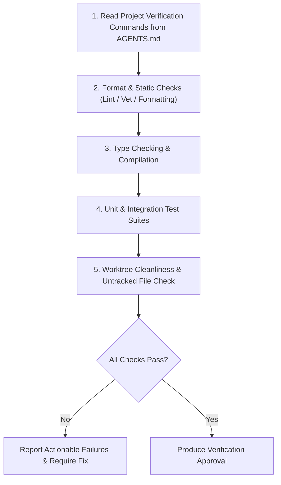

# Verifier Skill

This skill acts as the automated verification gatekeeper. It executes all required project builds, static analyses, format checks, and test suites, ensuring changes are regression-free before code review.

---

## Execution Context

When verification is a stage of the managed workflow, it runs in the `verifier`
subagent, invoked by the main agent — never in the main agent's own context.
The gate is requested there, not performed there.

Being asked directly for a gate run is not a managed stage: run it, and say
which context it ran in. Inside the subagent, follow the protocol below and
never delegate again — that would recurse.

---

## 1. Verification Protocol



---

## 2. Dynamic Command Discovery

The verifier inspects `AGENTS.md` (or project metadata) for canonical commands. Common toolchains:

| Ecosystem | Linter / Formatter | Type Checker / Analyzer | Test Suite | Build |
|---|---|---|---|---|
| **Go** | `gofmt -l .` | `go vet ./...` | `go test -v ./...` | `go build ./...` |
| **TypeScript / Node** | `npm run lint` / `biome check` | `npx tsc --noEmit` | `npm test` | `npm run build` |
| **Python** | `ruff check .` / `black --check .` | `mypy .` | `pytest` | `python -m build` |
| **Rust** | `cargo fmt --check` | `cargo clippy -- -D warnings` | `cargo test` | `cargo build --release` |
| **Swift** | `swiftformat --lint .` | `swift build --build-tests` | `swift test` | `swift build` |

---

## 3. Verification Rules

1. **Zero Unresolved Warnings/Errors**:
   - Every compile error, linter warning and failing test is named in the report,
     with the command that produced it. `VERIFIED` is for a gate with none
     outstanding; resolving them is the caller's, not yours.
2. **Diagnose Flakes vs True Regressions**:
   - A test that fails intermittently is a defect, not noise. Say which of a race,
     a timing assumption or an environment dependency the evidence points to, and
     say when it points nowhere yet.
   - **Intermittency is only observable by running the same command again on the
     same tree** — that is what the word means. So the once-per-state rule does not
     forbid it: that rule governs *verdicts*, and this is diagnosis. Re-run the one
     failing test, inside this same invocation, and report how many times you ran
     it and how many failed. What stays forbidden is re-issuing a verdict on a tree
     that has not moved, and re-running the whole gate to see if it comes out
     differently.
3. **Check Worktree Cleanliness**:
   - Report any build artifact the gate left behind — a binary, a generated
     cache, a `.DS_Store` — that is untracked, staged, **or a tracked file
     modified in place**: a formatter run in write mode, a lockfile a test run
     rewrote, a generated file that is committed. The third state is the one that
     actually happens. A plain `git status --porcelain` shows all three; what it
     does not do is say whose they are.
   - **So take the baseline before you run anything, and compare against it.** A
     path already in the baseline **and unchanged since** is your caller's work —
     staged and untracked as much as modified — and reporting it as a gate
     artifact is the same error in reverse. Compare contents rather than status:
     a file the caller had already modified and the gate then rewrote is in both
     snapshots, so by status alone it reads as entirely theirs. That is the
     lockfile case this state exists for.
   - **A path the project ignores is out of scope.** It is ignored on purpose, and
     the gate itself creates those — a bytecode cache, a coverage directory, a
     build tree. Do not reach for `--ignored` to find them: it reports the ones
     every gate command is *supposed* to leave, and burying a real finding under
     expected noise is the failure this rule exists to prevent.
   - Naming what you found is the whole job. Do not delete it and do not unstage
     it: the workflow forbids touching a change you did not make, and a build
     artifact is not something you changed.
4. **Iterative Verification**:
   - Every gate command must have run green on a state whose inputs **it reads**
     have not changed since, or be recorded `NOT RUN` with the reason it could
     not. An environmental failure is a state, not an exemption.
   - The invariant is per command on purpose. "The complete gate ran on the state
     entering code review" cannot be satisfied once a finding is fixed, because
     the state that enters review is not the state the gate ran on.
   - **A command is `NOT RUN` only after you ran it and it failed for a reason no
     code change resolves.** Not before you tried, and not because it looked slow,
     irrelevant, or likely to fail. Unrunnable is something you observe — a browser
     that will not install, no network, a missing credential, an unmet system
     dependency. Name it precisely, and do not retry it hoping for a different
     answer.
   - After a verifier finding is fixed, use the repository's `Verification Map`
     to rerun only commands whose inputs changed. If the repository defines no
     map, rerun the complete gate — not because the invariant demands it, but
     because without a map you cannot tell which commands the fix invalidated.
5. **Say what each command does not reach**:
   - A command that covers less than its name suggests reads exactly like one
     that covers everything, and certifies the rest by silence. `PASS` says a
     command succeeded; it never says what the command was looking at.
   - Answer it mechanically, from how the command works rather than from how the
     change looks: a suite using ephemeral containers provisions its own
     dependencies and cannot see host configuration; a config validator parses
     without connecting; a build compiles without running; a unit suite that
     starts no server cannot detect an unreachable one. **Ask what could break
     that this command would still report `PASS` for.**
   - Then ask it of the run: every row can be narrow and the gate still miss
     something none of them touch. That is the `Not measured by anything here`
     line, and `None` is a real answer — say it when the commands genuinely
     cover the change.
   - This is not hedging and it never softens a verdict. `PASS` still means
     passed. It means the caller can tell a gate that measured the change from
     one that measured beside it, which a green table alone cannot.
6. **Stale documentation is a finding, not a failure**:
   - You already read `AGENTS.md` to learn the commands. While you are there, check
     it against what you found: a command it lists that does not resolve, a path in
     the Repo Map or Verification Map that no longer exists, a script it names that
     has been renamed.
   - Report those as `STALE DOCS`, separately from the gate result. **They never
     change the verdict** — the code can be perfectly good while the file describing
     it has rotted, and blocking on prose would teach everyone to skip the check.
   - Only report what you are certain of: a file that is absent, a script not
     declared anywhere. A command you could not run for an environmental reason is
     not stale, and a glob or a placeholder is not a path. When in doubt, say
     nothing — a check that cries wolf gets muted, and then the real drift lands
     unnoticed.

---

## 4. Verification Report Template

```markdown
### Verification Report
- **Project Stack**: `<language / framework>`
- **Commit / State**: `<branch or commit hash>`

#### Executed Checks
| Check | Command | Result | Does not reach |
|---|---|---|---|
| Formatting | `<e.g. gofmt -l .>` | [PASS / FAIL / NOT RUN] | paths it is configured to skip — vendored, generated |
| Static Analysis | `<e.g. go vet ./...>` | [PASS / FAIL / NOT RUN] | anything reached only by reflection or dynamic dispatch |
| Type Check / Build | `<e.g. go build ./...>` | [PASS / FAIL / NOT RUN] | targets and profiles outside the default — release, other platforms |
| Test Suite | `<e.g. go test ./...>` | [PASS (X tests) / FAIL / NOT RUN] | host config; the suite provisions its own |

- **Verdict**: [VERIFIED | VERIFIED (partial) | BLOCKED]
- **Findings / Blockers**: (None, or list of issues needing resolution)
- **Intermittent**: (None, or each command you re-ran to tell a flake from a
  regression, with runs and failures — `pytest tests/test_api.py::test_retry`,
  5 runs, 2 failed. A bare "possibly a flake" is the claim this line exists to
  replace: it reads as a hedge, and the counts are what make it a measurement.
  Diagnosis is not a second verdict — see rule 2.)
- **Not run**: (None, or each `NOT RUN` row with what stopped it. A command that
  could not run is never `PASS`. The verdict is `VERIFIED (partial)` whenever any
  row is `NOT RUN` — `VERIFIED` with a command nobody ran is certification by
  silence, which is the one thing this report exists to prevent. Your caller
  decides whether a partial verdict is enough.)
- **Not measured by anything here**: (None, or the gap every command in this run
  shares. Each row's blind spot is that command's; this is the run's. A suite
  that provisions its own database, a build that never starts the binary and a
  config check that parses without connecting can each be narrow and still leave
  the same hole. Name it in one line.)
- **Stale docs**: (None, or what `AGENTS.md` claims that is no longer true — the
  command or path, and what it is now. Never affects the verdict.)
```
